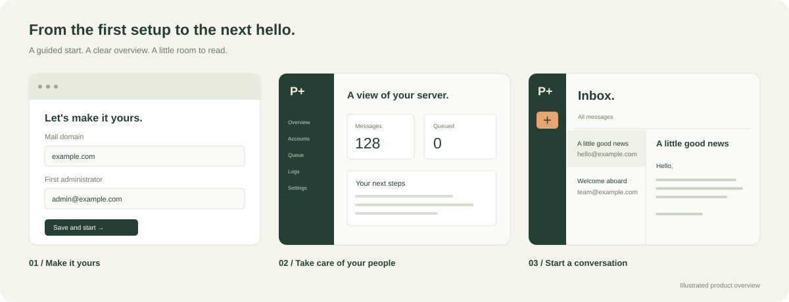

<p align="center">
  
</p>

<p align="center">
  A mail server with browser-based setup, a dedicated administration panel, and Webmail.<br>
  Create accounts, send and receive mail, and manage your server in one place.
</p>

<p align="center">
  <a href="docs/getting-started.md">Getting started</a> ·
  <a href="docs/getting-started.zh-CN.md">中文入门指南</a> ·
  <a href="docs/configuration.md">Configuration reference</a> ·
  <a href="docs/protocols.md">Protocol support</a>
</p>

## A home for your email

- **Start in your browser.** Run PostPlus, open the setup address printed in the terminal, and create your first administrator.
- **Keep administration separate.** Manage accounts, inspect a user’s mail without changing its read status, set individual storage quotas, and review queues and logs. Webmail runs on its own port.
- **Give every message a place.** Use Inbox, Sent, Drafts, Trash, Junk, and Archive. Save a draft, resume writing later, and move messages between folders.
- **Set up encrypted connections.** Request a Let’s Encrypt certificate through the browser, or use certificates you already have.
- **Use your preferred language.** Setup, administration, and Webmail default to English and support Simplified Chinese.
- **Connect mail clients.** Send through SMTP and read through POP3 or the supported IMAP commands, with TLS support.
- **Keep mail on disk.** Accounts, mailboxes, delivery queues, and retries survive restarts. Rejected mail is retained in quarantine.
- **Choose who has an account.** Administrators create users; Webmail has no public registration.

<p align="center">
  
</p>

PostPlus is under active development. The current release supports local mail workflows and outbound delivery through an SMTP relay. See [Current scope](#current-scope) before planning an internet-facing installation.

## Quick start

Install [xmake](https://xmake.io/) 2.9.8 or newer and a C++20 compiler. Windows users need Visual Studio 2022's **Desktop development with C++** workload; Linux users can use GCC 12 or newer; macOS users need current Xcode Command Line Tools.

From the repository root:

```sh
xmake f -m release -y
xmake build -y
xmake run postplus
```

On an unconfigured installation, the terminal tells you that setup is required and prints:

- The **setup address**, normally `http://127.0.0.1:8081/`.
- A random **one-time setup password**, used to unlock the setup page.

Open that address on the server machine, enter the setup password, then choose your domain and create a permanent administrator password. For a first local trial, keep the loopback addresses and select local development mode. Save the form to start the services.

| Interface | Local development default |
| --- | --- |
| Administration | `http://127.0.0.1:8081/` |
| Webmail | `http://127.0.0.1:8080/` |

Sign in to administration to create users and adjust settings. Sign in to Webmail to read or compose mail. **Ctrl+C** stops the whole service group; the same launch command loads your saved installation next time. TLS-enabled installations use HTTPS.

For remote servers, domain and certificate setup, relay delivery, account creation, and troubleshooting, follow the **[step-by-step guide](docs/getting-started.md)** or **[中文入门指南](docs/getting-started.zh-CN.md)**.

### Run an existing installation

```sh
xmake run postplus --config "config/postplus.json"
xmake run postplus --help
```

The default configuration is `config/postplus.json`. An existing sample with no configured service-token source and no completed-setup marker enters setup; an established configuration starts its saved services. Invalid or unreadable configurations are reported rather than silently discarded.

The native launcher starts and monitors all service processes. A standalone installation keeps `postplus`, all `postplus-*` service executables, and the bundled `web` directory together. Build output is under `build/<platform>/<arch>/<mode>/`. `xmake run` uses the repository root and refreshes the web bundle. Python is needed only for integration tests, not to start the server.

## Configure and operate

Storage-size fields offer byte, KiB, MiB, GiB, and TiB selectors while configuration files retain exact integer byte values. Per-user quotas in **User accounts → Storage quota** take effect immediately; global settings apply after a manual restart.

Most day-to-day options are available in **Administration → Server settings**: listener addresses and ports, TLS, relay delivery, filtering, resource limits, sessions, and logging. Saving validates the configuration, creates a backup, and shows the addresses that will apply after restart. The current services keep running. When ready, press **Ctrl+C** in the launcher terminal, wait for shutdown, then run the same launch command to apply the saved settings.

- [Getting started](docs/getting-started.md) — from first launch to your first message.
- [中文入门指南](docs/getting-started.zh-CN.md) — 本地试用、域名与 TLS、后台设置和常见问题。
- [Configuration reference](docs/configuration.md) — field names, defaults, examples, secrets, and manual editing.
- [Architecture and operations](docs/architecture.md) — process lifecycle, delivery, logging, and backups.
- [HTTP API](docs/api.md) — sessions, Webmail, administration, settings, and setup.

The [example configuration](config/postplus.example.json) is a reference for manual management. The browser wizard generates a private service credential automatically. Mail data stays in the installation's data directory; changing that directory later requires a deliberate offline migration.

External recipients require a configured SMTP relay. Full antivirus scanning requires a separately installed and maintained ClamAV service. PostPlus can request Let’s Encrypt certificates using HTTP-01. You configure DNS, public port 80 reachability, and any external relay or antivirus service. Automatic certificate renewal is not implemented.

## Architecture and development

PostPlus uses **C++20**, **standalone Asio**, **OpenSSL 3**, **SQLite**, and **xmake**. Authentication and storage each own their SQLite database. Other services use authenticated loopback RPC instead of accessing those databases directly.

| Executable | Responsibility | Default listener |
| --- | --- | --- |
| `postplus` | Setup and service supervision | Setup: loopback 8081 |
| `postplus-admin` | Administration, accounts, settings, queue and logs API | Loopback 8081 |
| `postplus-web` | Webmail and mailbox API | Loopback 8080 |
| `postplus-smtp` | ESMTP reception and authenticated submission | Loopback 2525 |
| `postplus-pop3` | POP3 mailbox access | Loopback 1110 |
| `postplus-imap` | IMAP mailbox access | Loopback 1143 |
| `postplus-auth` | Accounts, password verification, administrator roles | Loopback 18081 |
| `postplus-storage` | Mailboxes, persistent UIDs, MIME, delivery queue | Loopback 18082 |
| `postplus-filter` | MIME inspection, spam rules, EICAR detection, ClamAV client | Loopback 18083 |
| `postplus-transfer` | Outbound SMTP through a configured relay | Loopback 18084 |
| `postplus-delivery` | Queue processing, retries, local delivery, quarantine | Loopback 18085, instance lock only |
| `postplus-ctl` | Command-line administration | None |
| `postplus-clean-data` | Offline reset of accounts, mail, and queues, with a dry-run option | None |

### Build and test

```sh
xmake f -m debug -y
xmake build -y
xmake test -v
node tests/web_test.js
python tests/integration.py --build-dir build --mode debug
```

xmake installs pinned dependencies. Web checks require Node.js 22 or newer; integration tests require Python 3.10 or newer. Tests use isolated data directories, local accounts and ports, and a simulated relay. They do not send public email. Diagnostics are written under `build/test-runs/`.

[GitHub Actions](.github/workflows/ci.yml) builds and tests Linux, Windows, and macOS in Debug and Release. The source layout is:

```text
include/postplus/       Shared networking, MIME, setup, and process interfaces
src/core/              Networking, TLS, HTTP, logging, MIME, setup, configuration
src/services/          Independent service entry points
src/tools/             Native launcher and administration CLI
config/                Example configuration
web/                   Webmail, administration, setup, icons, and translations
docs/                  Guides, references, and architecture
tests/                 C++ tests, web checks, and integration suites
.github/workflows/     Cross-platform CI
```

## Current scope

- IMAP implements a [documented command subset](docs/protocols.md); full client compatibility, IDLE, ENVELOPE, and BODYSTRUCTURE remain outside the current scope. POP3 does not yet provide an exclusive maildrop lock.
- Webmail reads and composes plain text across six built-in folders. Attachment upload/download, HTML rendering, and custom folder creation are not implemented. A Sent copy records successful submission to the queue, not proof of final delivery.
- Outbound delivery uses an SMTP relay. Direct MX delivery, SPF/DKIM/DMARC processing, DSN generation, multiple domains, and multi-host high availability are not implemented.
- SMTP queues mail transactionally. Local delivery is idempotent; retrying outbound mail after an interrupted acknowledgement can produce a duplicate.
- Sessions use bounded worker pools, SQLite serializes writes, and delivery uses one worker. Capacity for hundreds or thousands of active users requires representative workload testing and further development.
- OS service installation, automatic boot integration, automatic certificate renewal, and DNS automation are not bundled.

Protocol compatibility and security are the development priorities. Contributions should include focused verification; [internal RPC contracts](docs/internal-contract.md) describe service integration.

## License

PostPlus is licensed under the [GNU General Public License v3.0](LICENSE).
