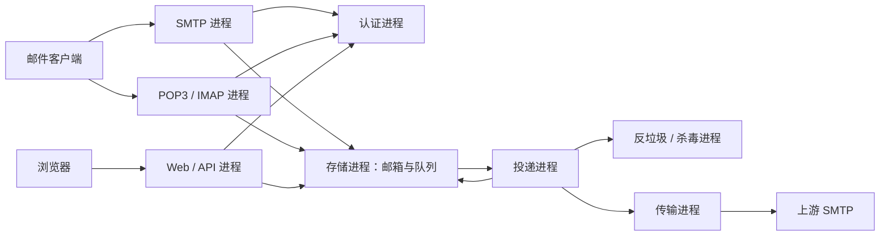

# PostPlus

C++20 多进程邮件服务器，使用 **xmake** 构建、**standalone Asio** 网络库（不依赖 Boost）、OpenSSL 3 和 SQLite。目标平台：Linux、Windows、macOS。

**当前版本：0.1 开发版。** 已能端到端收发本地邮件，通过 SMTP、POP3、IMAP 和 Webmail 访问，并具有持久队列、用户认证、邮件扫描和管理 API。协议仍有明确的兼容范围，尚不能作为完整的生产邮件服务器。项目当前优先级是**协议兼容与安全**，容量目标为**数百到数千用户**；该目标尚未经过生产负载验证。

## 进程划分

| 程序 | 职责 | 默认监听 |
| --- | --- | --- |
| `postplus-auth` | 账户、密码哈希、认证、管理员身份 | 本机 18081 |
| `postplus-storage` | 邮箱、UID、原始 MIME、持久投递队列 | 本机 18082 |
| `postplus-filter` | MIME 解码、规则评分、EICAR 检测、ClamAV 接入 | 本机 18083 |
| `postplus-transfer` | 经指定上游 SMTP 发送外域邮件 | 本机 18084 |
| `postplus-delivery` | 队列消费、扫描、本地投递、失败重试和隔离 | 本机 18085 仅作单实例锁 |
| `postplus-smtp` | ESMTP 接收与认证提交 | 2525 |
| `postplus-pop3` | POP3 邮箱访问 | 1110 |
| `postplus-imap` | IMAP 邮箱访问 | 1143 |
| `postplus-web` | Webmail、后台管理、HTTP API | 8080 |
| `postplus-ctl` | 本机命令行管理工具 | 无 |



内部 RPC 使用 HTTP/1.1 JSON，只绑定 IPv4 loopback，并校验环境变量中的共享服务令牌。原始邮件在 RPC 层使用 Base64，避免非 UTF-8 邮件内容被 JSON 转码。认证与存储分别拥有自己的 SQLite 数据库；其他进程不直接打开数据库。服务令牌代表内部完全权限，应仅提供给受信任的服务账户。

## 构建与测试

需要 C++20 编译器、xmake 2.9.8+，集成测试和开发启动器需要 Python 3.10+。

- Windows：Visual Studio 2022+ 的 C++ 桌面开发工具链。
- Linux：GCC 12+ 或支持 C++20 协程的 Clang。
- macOS：支持 C++20 的 Xcode Command Line Tools。

```sh
xmake f -m debug -y
xmake build -y
xmake test -v
python tests/integration.py --build-dir build --mode debug
```

xmake 自动安装固定版本的 Asio、nlohmann/json、OpenSSL 3、SQLite。构建产物在 `build/<platform>/<arch>/<mode>/`。如本机已有完整依赖配方而仓库更新网络不通，可在配置命令中加 `--policies=network.mode:private` 跳过配方仓库更新；首次依赖下载仍需要网络。

[GitHub Actions](.github/workflows/ci.yml) 在 Linux、Windows、macOS 上分别进行 Debug/Release 构建、C++ 单元测试和 Python 真实进程集成测试。集成测试使用临时账户、随机端口、隔离数据目录和本机模拟上游，不发送公网邮件。

## 本地运行

1. 复制 `config/postplus.example.json` 为 `config/postplus.json`。路径配置相对于配置文件所在目录解析。
2. 为所有进程设置相同的随机内部令牌，至少 32 字符。不要提交令牌、实际配置、数据库或服务器私钥。

PowerShell：

```powershell
$env:POSTPLUS_SERVICE_TOKEN = python -c "import secrets; print(secrets.token_hex(32))"
Copy-Item config/postplus.example.json config/postplus.json
```

Bash / Zsh：

```sh
export POSTPLUS_SERVICE_TOKEN="$(python3 -c 'import secrets; print(secrets.token_hex(32))')"
cp config/postplus.example.json config/postplus.json
```

3. 配置 `tls_certificate` 和 `tls_private_key`。默认拒绝明文认证。仅在本机开发时，可以显式将 `allow_insecure_auth` 设为 `true`；此例外也只允许 loopback 来源。
4. 启动服务组，例如 Windows Debug 构建：

```sh
python scripts/run.py --bin-dir build/windows/x64/debug --config config/postplus.json
```

Linux 通常使用 `build/linux/x86_64/debug`，Apple Silicon macOS 通常使用 `build/macosx/arm64/debug`；以实际目录为准。启动器在任一子进程退出时停止整组服务，Ctrl+C 关闭整组。它是开发工具；系统服务部署应使用 systemd、Windows Service 或 launchd 管理各个可执行文件。

5. 在继承同一令牌的另一个终端创建管理员，密码交互输入（至少 12 字节）：

```sh
xmake run postplus-ctl create-user admin@localhost --admin --config config/postplus.json
xmake run postplus-ctl create-user user@localhost --config config/postplus.json
xmake run postplus-ctl users --config config/postplus.json
xmake run postplus-ctl stats --config config/postplus.json
xmake run postplus-ctl queue --config config/postplus.json
```

若配置了 `domain`，账户地址使用该域名。Webmail **没有注册功能**；仅由管理员或命令行工具创建账户。

配置了证书时访问 `https://localhost:8080/`；显式启用本机明文测试时访问 `http://127.0.0.1:8080/`。邮件客户端的用户名为完整邮件地址，SMTP 使用 STARTTLS，POP3 使用 STLS，IMAP 使用 STARTTLS。测试端口可通过配置改成标准端口；低端口的系统权限由部署环境处理。

## 外发与扫描

外域投递需要设置 `smarthost_host`、`smarthost_port`，以及 `smarthost_tls`（`starttls` 或 `implicit`）。如上游要求认证，设置 `smarthost_username`，并通过 `smarthost_password_env` 指定的环境变量提供密码。TLS 会校验证书链和主机名；可用 OpenSSL 的 `SSL_CERT_FILE` / `SSL_CERT_DIR` 指定信任库。`none` 模式仅允许连接 loopback，且禁止明文上游认证。

默认只运行基线反垃圾规则及 EICAR 测试签名检测，**不等同于完整杀毒**。设置 `clamav_host` / `clamav_port` 后，通过 ClamAV INSTREAM 扫描原始邮件和解码后的 MIME 部分；ClamAV 的病毒库由独立部署的 ClamAV 维护。扫描故障会延迟重试，明确拒绝的邮件保留在隔离队列，管理员可从后台查看。

## 已实现的可靠性与安全措施

- SMTP 在所有收件人的任务提交事务后才确认入队；SQLite WAL + FULL 同步。
- 每个收件人独立重试，指数退避，上限一小时；故障任务不会按次数静默丢弃。
- 本地投递按任务 ID 幂等，删除邮件后保留投递记录，重试不会恢复已删除邮件。
- 外发采用 SMTP 的至少一次语义：上游接收成功后、本地确认前崩溃可能重复投递。
- 共享认证使用随机盐和 PBKDF2-HMAC-SHA256（至少 600,000 次），恒定时间比较，未知账户也执行密码哈希。
- TLS 最低 1.2；服务间令牌认证；外部未认证用户不能中继到外域。
- Web 会话使用安全随机令牌、HttpOnly / SameSite Cookie、CSRF 令牌、管理员权限检查和登录限流。页面以文本显示邮件内容，不执行邮件 HTML。
- 连接数、单行、HTTP 头、JSON 深度、消息大小、MIME 深度/数量、邮箱和队列均有限制；读取逻辑有整体操作超时。

## 兼容范围与下一阶段

详见 [协议支持表](docs/protocols.md)、[架构与容量计划](docs/architecture.md)、[HTTP API](docs/api.md) 和 [内部 RPC](docs/internal-contract.md)。

目前 IMAP 主要覆盖单一 INBOX 读取、UID、搜索、Seen/Deleted 和 EXPUNGE，尚未实现完整文件夹模型、APPEND、COPY、IDLE、ENVELOPE/BODYSTRUCTURE；POP3 尚无独占 maildrop 锁。Webmail 支持文本邮件收发，尚无附件上传下载、已发送文件夹和 HTML 邮件显示。未实现公网 MX 直投、SPF、DKIM、DMARC、DSN/退信、多域、多机高可用。

现有同步协议会话运行在有上限的工作线程池中，SQLite 写操作串行，投递为单工作进程。**不能据此宣称已经支持数千并发连接或数千用户的生产负载。** 下一阶段先完成协议兼容、安全边界和互操作测试，再以目标负载决定协程会话、存储索引和并行投递改造。

## 目录

```text
include/postplus/       网络、RPC、MIME 公共接口
src/core/              Asio/TLS/HTTP 基础与 MIME
src/services/          九个独立服务入口
src/tools/             CLI 管理入口
config/                配置示例
web/                   无框架静态 Webmail 与管理界面
tests/                 单元、协议、持久化和扫描集成测试
scripts/               开发进程组启动器
.github/workflows/     三平台在线编译测试
```

许可证见 [LICENSE](LICENSE)。
