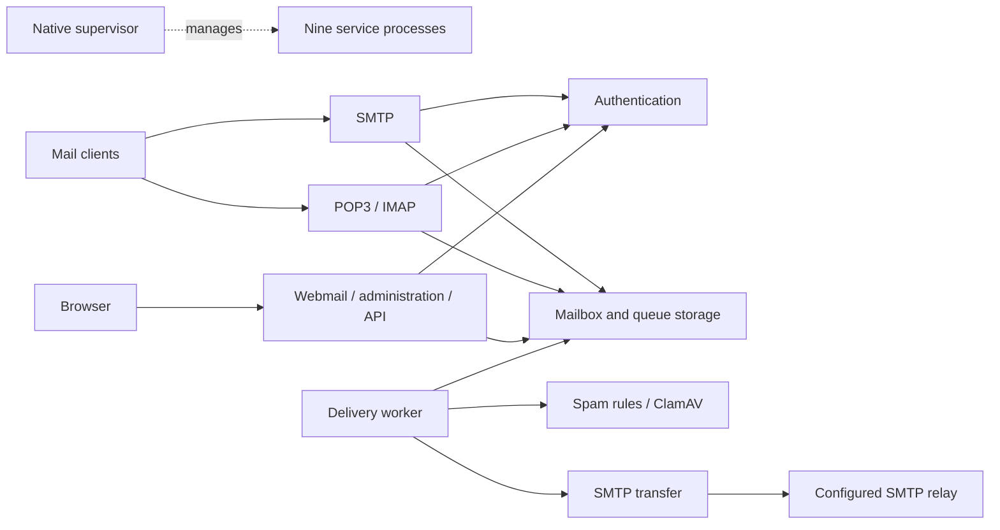

# Architecture, reliability, and operations

## Process boundaries

PostPlus is a single-host, multi-process mail server. SMTP, POP3, and IMAP own their client sessions and share authentication and storage RPC contracts. `postplus-auth` owns `auth.sqlite3`; `postplus-storage` owns `storage.sqlite3`. MIME parsing is a shared C++ library. Spam rules and the ClamAV client run in the filter service. Webmail and administrator APIs share the web service, with server-side role checks.

Internal RPC uses HTTP/1.1 JSON on `127.0.0.1`. Raw mail is encoded as Base64 on the RPC wire so binary content survives JSON transport. A shared token authenticates internal requests and grants full internal access; there is no remote RPC deployment mode or per-service authorization policy.

Run the services under a dedicated, trusted account. Newly created Unix data directories are owner-only and databases are owner-readable/writable. Windows installations should restrict data-directory ACLs. Setup creates its configuration and token files with restrictive permissions on both platform families.

## Native startup and shutdown

`postplus` locates its sibling executables and starts them directly, without a shell. It checks the installation and service ports before launch, then starts authentication, storage, filtering, and transfer before delivery and the public-facing services. Each service has a bounded readiness check. Any unexpected child exit stops the entire group and makes the launcher fail.

Ctrl+C or SIGTERM requests group shutdown. Children receive a graceful stop request and share a 35-second shutdown budget; remaining children are terminated and reaped. Windows children have no visible console windows, use stop events, and belong to a Job Object configured to terminate them when the launcher closes. Unix children use process groups and SIGTERM followed by SIGKILL when necessary. Linux additionally requests termination when the parent process dies.

The launcher can be run from a terminal or supervised by an OS service manager. Service installation, automatic restart policies, configuration reload, and boot integration are not bundled. Keep all service executables beside the launcher and retain access to the configured web assets.

## First-run configuration

Only a missing configuration file starts setup. Invalid JSON, unreadable existing files, and other existing configuration paths fail without being overwritten.

The native launcher serves a temporary setup page on IPv4 loopback, normally port 8080. A random per-run token is printed in a URL fragment; the page removes the fragment from the address bar and sends the token in `X-Setup-Token` headers. Setup checks loopback peers, allowed Host values, and supplied Origin headers. The normal web server does not expose setup routes.

The form configures a single domain, the first administrator, storage, all service ports, TLS, the SMTP relay, and ClamAV. Local development mode permits unencrypted authentication only from loopback. Public listening addresses require a valid, matching TLS certificate/key pair and disabled insecure authentication. Certificate generation, DNS changes, relay connectivity, and ClamAV installation are outside the wizard.

On submission, setup:

1. Validates field types, domain/account consistency, TLS files, and distinct available ports.
2. Writes a private random token file and an exclusive staging configuration beside the requested destination.
3. Starts an isolated authentication process and provisions the administrator through authenticated RPC. An existing account is accepted only when its password matches and it already has administrator privileges.
4. Stops the temporary authentication process and atomically commits the configuration without replacing an existing destination.
5. Closes the setup listener and starts the normal service group.

The plaintext administrator password is not written to configuration or log files. If provisioning or commit fails, temporary configuration and token files are cleaned up; the authentication database can retain a provisioned account. Retrying with the same administrator credentials handles that case without resetting an existing account.

`service_token_env` takes precedence when its environment variable is nonempty. Otherwise, `service_token_file` supplies the shared token. The wizard generates the latter so a new installation does not require manual environment setup. Relative paths in manually maintained configurations resolve from the configuration directory. Configuration changes require a restart; the setup API is not a general configuration editor.

## Receiving and delivering mail

1. SMTP validates local recipients. External recipients require authentication and a configured relay.
2. Storage creates one queue job per recipient in a single transaction. SMTP returns success only after commit.
3. The delivery worker reads a due job and invokes the filter service.
4. Explicit rejection persists the job in quarantine. Scanner, RPC, or storage failures trigger retries.
5. Local delivery is deduplicated by delivery ID and username. External mail is sent by the transfer service through the configured SMTP relay.

SQLite uses WAL and FULL synchronization. Restarts preserve accounts, messages, UIDs, UIDVALIDITY, queue state, retries, and deduplication records. `delivery_lock_port`, default 18085, is a loopback socket used as an exclusive worker lock and released by the OS when the process exits.

Retries use exponential backoff, capped at one hour. Local deduplication records survive message deletion so a retry cannot restore a deleted message. Outbound SMTP has at-least-once semantics: a crash after the relay accepts mail but before local acknowledgement can cause a duplicate.

There is no automatic DSN generation, retention cleanup, or quarantine-release interface. Permanent relay errors remain queued. Queue inspection exposes attempts, retry times, states, and diagnostic errors without exposing message bodies. An audited retention policy is needed before purging quarantine or deduplication records.

## Logging

The supervisor and services write structured JSON Lines logs under `log_dir`, defaulting to `<data_dir>/logs`. Entries contain `timestamp` in UTC, `service`, `level`, `pid`, and `message`. Log levels are `debug`, `info`, `warn`, and `error`; the configured threshold defaults to `info`.

Files are named `<service>.jsonl`, with `.1` through `.N` rotation backups. `log_max_bytes` defaults to 5 MiB and accepts 1 KiB through 100 MiB. `log_backups` defaults to 3 and accepts 1 through 10. A per-service interprocess lock serializes appends and rotation. The CLI shares the `postplus` log file.

Events include service lifecycle, delivery results, login outcomes, and administrator account operations. Callers exclude credentials and message bodies; the logger additionally redacts the configured service token and relay password and removes terminal control characters. Logging failures are reported to stderr without aborting mail transactions. Logs are diagnostic records, not a durable transactional audit ledger.

Administration shows recent entries with service and exact-level filters. Its API reads at most 64 KiB from each current/rotated file and returns up to 500 entries, newest first, with a `truncated` flag. This bounded snapshot is not a complete log export. File rotation can race with reads; unavailable tails are skipped.

All web interfaces default to English and offer Simplified Chinese. The browser stores the language preference locally. Account data, mail content, API field names, and recorded log messages are not translated.

## Resource model and security limits

Standalone Asio performs asynchronous socket, TLS, and timer operations. Protocol code composes them through blocking `Connection` sessions on a bounded worker pool. `max_connections` defaults to 32 per listening service; excess connections are closed rather than queued without a bound. This is a session limit, not an account limit.

HTTP handles one request per connection. Keep-alive, chunked requests, HTTP/2, and trusted reverse-proxy identity headers are not implemented. Request lines, headers, and bodies share a total deadline. Login bodies are limited to 16 KiB, and authenticated web operations check the session and CSRF before reading large bodies. SMTP DATA has a separate total deadline, defaulting to 120 seconds. Services close listeners and mark active connections for cancellation when stopping.

Passwords use salted PBKDF2-HMAC-SHA256 with at least 600,000 iterations and constant-time comparison. Unknown users incur password-hashing work. Auth currently limits verification to 30 attempts per account per minute and 600 globally. Web login additionally limits each IP to 20 attempts per minute and the web process to 120. These in-memory limits reset on restart.

TLS requires version 1.2 or newer. Web sessions use random tokens, HttpOnly/SameSite cookies, CSRF checks, and administrator roles. The mail viewer renders text rather than executing message HTML. Input sizes, parser depth, mailbox size, and queue resources are bounded; detailed protocol behavior is documented in [protocols.md](protocols.md).

## Capacity and development priorities

The architecture targets deployments with hundreds to thousands of accounts, but that capacity has not been validated. The current worker pools, serialized SQLite writes, and single delivery worker require representative workload measurements.

Development priorities are:

1. Complete IMAP interoperability, POP3 locking, and regression tests with real mail clients.
2. Extend protocol fuzzing, TLS/state-machine tests, rate limits, session revocation, and service-specific authorization.
3. Measure authentication latency, SMTP enqueue latency, queue age, FETCH throughput, memory, threads, and disk synchronization under realistic mailbox sizes and active-session counts.
4. Use those measurements to guide coroutine sessions, bounded hash/database execution, content-storage separation, and leased parallel delivery.
5. Add backup/recovery tooling, retention policy, quarantine review, service packaging, and internet-mail features as required.

## Backup and recovery

For a consistent offline backup, stop the entire service group and copy the data directory, configuration, service-token file, and TLS credentials to protected storage. Copying only live `.sqlite3` files can omit WAL contents; a future online backup facility should use SQLite's backup API.

After restoring, validate authentication, UIDs, and queue state on isolated ports before accepting mail. Treat authentication and storage databases as one installation snapshot rather than independently rolling one back.
